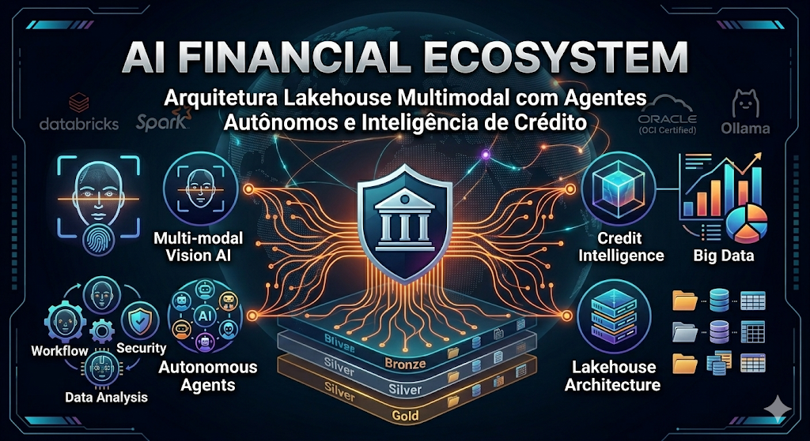

# 🏦 AI Financial Ecosystem: Arquitetura Lakehouse Multimodal com Agentes Autônomos e Inteligência de Crédito

## End-toEnd Banking Solution | OCI Certified | Databricks, Spark, RAG & Vision AI

Projeto em Construção !!



---

## 🏅 Badges

- 📦 Tamanho do repositório:  
  

- 📄 Licença do projeto:  
  

---

## 📋 Índice

- [📖 Descrição](#-descrição)
- [🧩 Funcionalidades](#-funcionalidades)
- [🚀 Execução](#-execução)
- [🧰 Tecnologias](#-tecnologias)
- [📊 Arquitetura](#-arquitetura)
- [🔄 Pipelines ETL](#-pipelines-etl)
- [📂 Dados de Exemplo](#-dados-de-exemplo)
- [⚙️ Automação](#-automação)
- [📈 Observabilidade](#-observabilidade)
- [🧪 Testes](#-testes)
- [🔒 Configuração](#-configuração)
- [🤖 Modelos de Machine Learning](#-Modelos-de-Machine-Learning)
- [🌐 Integração com Engenharia de Dados, Ciência de Dados e Machine Learning](#-Integração-com-Engenharia-de-Dados,-Ciência-de-Dados-e-Machine-Learning)
- [👨‍💻 Desenvolvedor](#-desenvolvedor)
- [📜 Licença](#-licença)
- [🏁 Conclusão](#-conclusão)

---

## 📖 Descrição

## 📖 Descrição

O **BankPy** é um projeto de engenharia de dados aplicado a um sistema bancário em Python. Ele cobre todo o ciclo de ingestão, transformação e armazenamento de transações financeiras, integrando múltiplas tecnologias modernas: **FastAPI, PostgreSQL, MongoDB, Redis, Apache Spark, Apache Airflow, Superset, Grafana e Streamlit**.

Além da camada de engenharia de dados, o projeto evolui para incluir **modelos de Machine Learning**, capazes de prever saldo, detectar fraudes, segmentar clientes e recomendar produtos financeiros. Os resultados desses modelos podem ser acompanhados em tempo real por meio de dashboards no Superset e Grafana, além de uma interface interativa construída em Streamlit.

---

## 🧩 Funcionalidades

- CRUD de clientes, contas e transações.
- API REST com FastAPI.
- ETL com Airflow + Spark.
- Exportação de transações para CSV.
- Persistência em Postgres, MongoDB e Redis.
- Dashboards com Superset e Grafana.
- Automação com scripts PowerShell e CLI Python.
- Testes automatizados com Pytest.

---

## 🚀 Execução

1. Clone o repositório e copie `.env.example` para `.env`.
2. Ajuste variáveis de ambiente (Postgres, MongoDB, Redis, Superset).
3. Suba os serviços:
   ```bash
   docker-compose up -d --build
4. Acesse:

   API → http://localhost:8000

   Airflow → http://localhost:8088

   Superset → http://localhost:8089
    
   Grafana → http://localhost:3001
    
   PgAdmin → http://localhost:5050
    
   Spark Master UI → http://localhost:8080

---

## 🧰 Tecnologias / Technologies

<p>
  
  
  
  
  
  
  
  
  
  
  
  
  


  
</p>

<br clear="all"/>

---

## 📊 Arquitetura

```
+-------------------+        +-------------------+        +-------------------+
|   API Python      | -----> |   Airflow DAGs    | -----> |   Spark Cluster   |
|   (FastAPI)       |        |   (ETL/ELT)       |        |   (Master/Worker) |
+-------------------+        +-------------------+        +-------------------+
        |                                                        |
        v                                                        v
+-------------------+                                    +-------------------+
|   Postgres        |                                    |   MongoDB / Redis |
|   (Relacional)    |                                    |   (NoSQL + Cache) |
+-------------------+                                    +-------------------+
```
---

## 🔄 Pipelines ETL

etl_clientes_pipeline → Postgres → Spark → MongoDB + Redis.

spark_to_postgres → Spark → Postgres (para relatórios SQL).

Jobs Spark:

clientes_flat.py → agregados por estado.

contas_flat.py → agregados por cliente.

transacoes_flat.py → agregados por CPF.

validate_data.py → validação dos CSVs.

---

## 📂 Dados de Exemplo

clientes_flat.csv → dados cadastrais (nome, email, renda estimada).

contas_flat.csv → contas bancárias (account_id, cliente_id, saldo).

transactions_flat.csv → histórico de transações (deposit, withdraw, transfer).

---

## ⚙️ Automação

CLI (cli.py) → comandos para criar clientes, abrir contas, depositar, sacar, transferir e rodar ETL.

Scripts PowerShell:

BankPy.ps1 → subir/derrubar ambiente, seed, ETL, testes.

airflow_dag_debug.ps1 → debug de DAGs no Airflow.

automacao-superset.ps1 → setup automatizado do Superset.

setup-bankpy.ps1 → inicialização rápida do banco.

---

## 📈 Observabilidade

Superset → dashboards SQL configurados via superset_config.py.

Grafana → monitoramento e relatórios.

PgAdmin → administração do Postgres.

---

## 🧪 Testes

Unitários → CRUD de clientes, contas e transferências.

Integração → seed + ETL + geração de CSV.

End-to-End → fluxo completo da API (clientes, contas, depósitos, saques, transferências).

Rodar testes:
```
docker-compose -f docker-compose.tests.yml up --build --abort-on-container-exit
```

---

## 🔒 Configuração

.env.example → modelo de variáveis de ambiente.

.dockerignore / .gitignore → ignoram logs, caches e dados sensíveis.

alembic.ini → configuração do Alembic.

pyproject.toml → metadados do projeto.

requirements.txt → dependências (Airflow providers, psycopg2, pandas, pyspark).

---

## Modelos de Machine Learning

Os modelos estão em `dags/ml/` e podem ser executados de duas formas:

1. **Via Airflow DAG**  
   - O DAG `bankpy_pipeline` dispara os scripts após a validação dos dados.
   - Os resultados são gravados automaticamente na tabela `ml_results` do Postgres.

2. **Manual (para testes)**  
   - Entre no container do Airflow:
     ```bash
     docker exec -it airflow_scheduler bash
     ```
   - Rode o script desejado:
     ```bash
     python dags/ml/fraude_detect.py
     ```
   - O resultado será gravado em `ml_results`.

3. **Exploração em Jupyter**  
   - Use os notebooks em `notebooks/` para prototipar e visualizar os modelos.

---

## 🤖 Integração com Engenharia de Dados, Ciência de Dados e Machine Learning

O **BankPy** evolui para um ecossistema completo de dados, cobrindo três pilares:

### 🔹 Engenharia de Dados
- Pipelines ETL com Airflow e Spark.  
- Armazenamento híbrido (Postgres, MongoDB, Redis).  
- Orquestração com Docker Compose.  
- Scripts SQL para inicialização e simulação de dados.  

### 🔹 Ciência de Dados
- Agregações estatísticas com Spark (médias, totais, contagens).  
- Validação e profiling dos dados (`validate_data.py`).  
- Dashboards interativos com Superset e Grafana.  

### 🔹 Machine Learning
Expansão do projeto para incluir modelos preditivos e prescritivos:
- **Previsão de saldo** → regressão ou séries temporais para estimar evolução do saldo.  
- **Detecção de fraude** → classificação supervisionada para identificar transações suspeitas.  
- **Segmentação de clientes** → clustering (K-Means, DBSCAN) para agrupar perfis de clientes.  
- **Recomendação de produtos financeiros** → sistemas de recomendação baseados em histórico de transações.  

### 🔹 Fluxo Completo

```
ETL (Airflow + Spark) → Data Lake (Postgres/MongoDB)
→ Ciência de Dados (exploração + dashboards)
→ Machine Learning (modelos preditivos/detecção)
→ API/Serviços
```
---

## 👨‍💻 Desenvolvedor / Developer

- [Rogerio](https://github.com/Rogerio5)
- [Ronaldo](https://github.com/Ronaldo94-GITHUB)

---

## 📜 Licença / License

Este projeto está sob licença MIT. Para mais detalhes, veja o arquivo LICENSE.

This project is under the MIT license. For more details, see the LICENSE file.

---

## 🏁 Conclusão

O BankPy demonstra como aplicar conceitos de engenharia de dados em um sistema bancário realista, integrando múltiplas tecnologias para ingestão, transformação, análise e visualização de transações financeiras. É um projeto completo, com infraestrutura Docker, pipelines ETL, API REST, automação, observabilidade e testes automatizados.

Com a adição dos modelos de Machine Learning, o BankPy evolui para um ecossistema de dados ainda mais robusto, capaz de gerar previsões de saldo, detectar fraudes, segmentar clientes e recomendar produtos financeiros. Os resultados desses modelos já podem ser acompanhados em tempo real por meio de dashboards interativos no Superset, Grafana e Streamlit.

Nos próximos passos planejados, o projeto poderá incluir modelos de séries temporais para previsão de saldo, algoritmos avançados de detecção de fraude e técnicas de clustering mais sofisticadas (como DBSCAN ou Gaussian Mixture Models), ampliando ainda mais a capacidade analítica e preditiva do sistema
